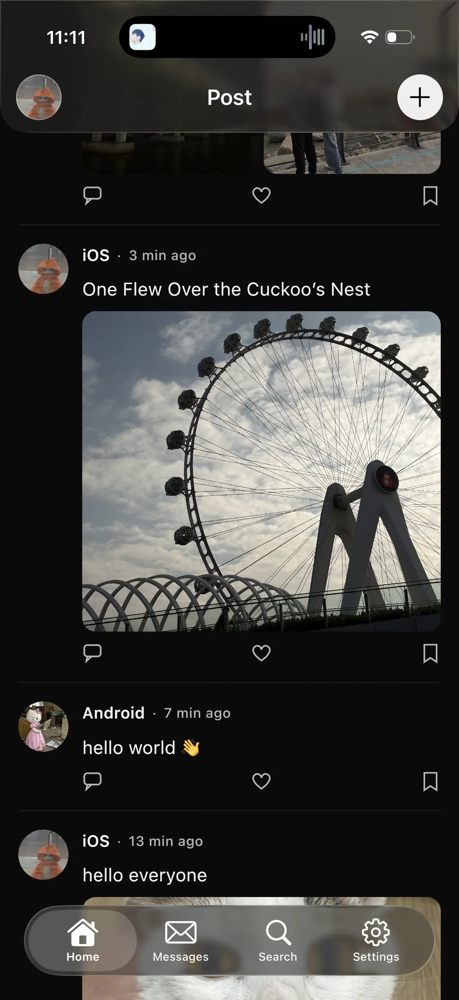
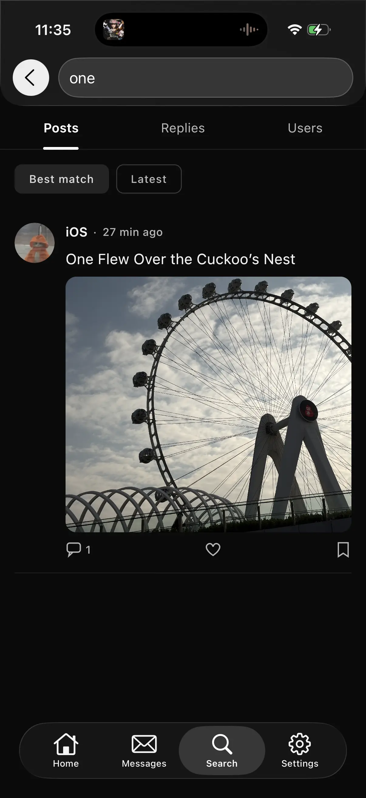
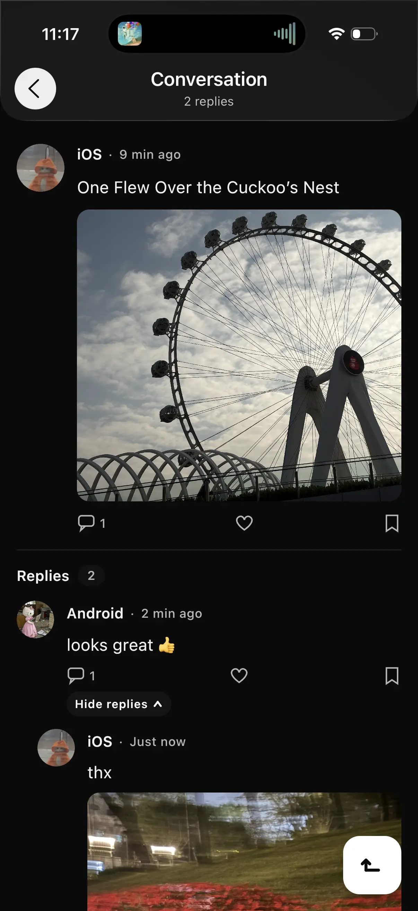
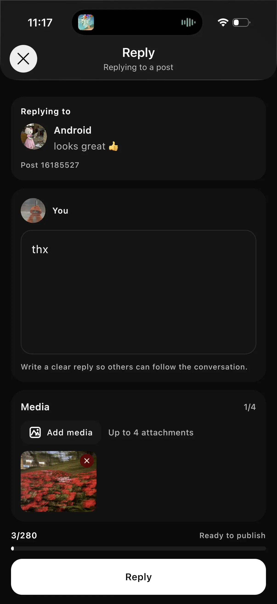
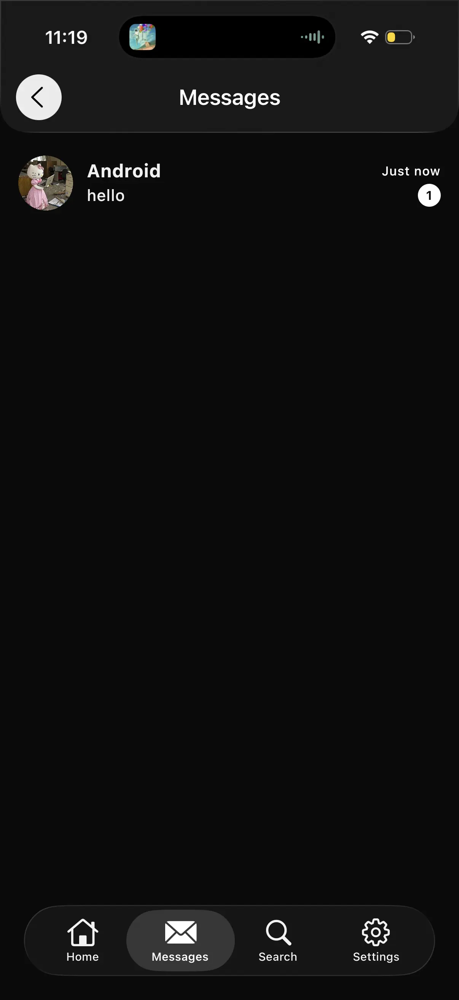
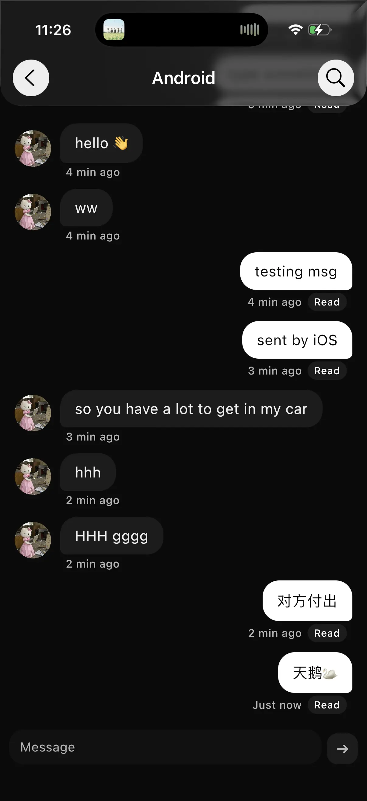
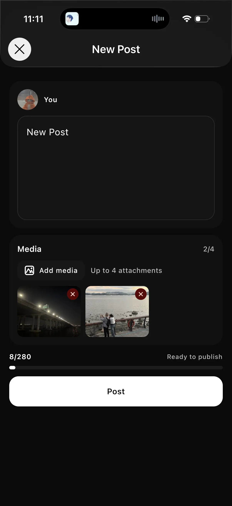
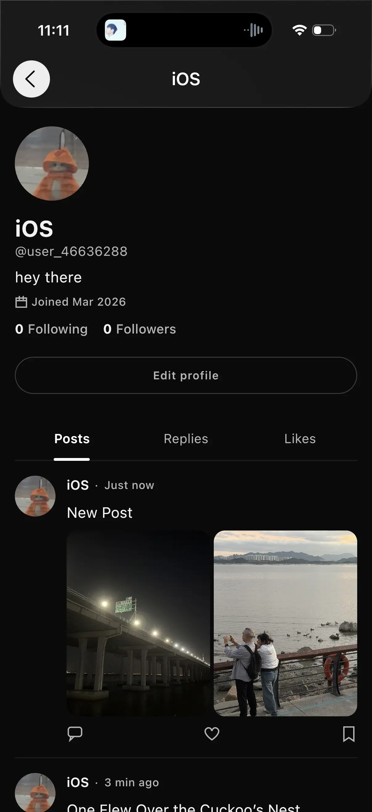
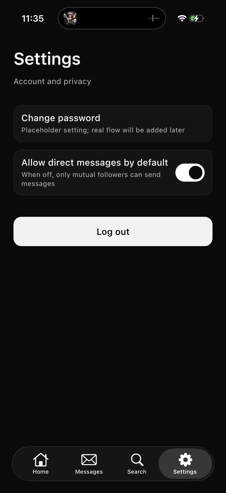

# Kwitter

基于 `Kotlin Multiplatform` + `Compose Multiplatform` 的社交客户端，在 `commonMain` 共享核心 UI 与业务逻辑，目标是在 Android 与 iOS 之间复用状态模型、数据链路与交互骨架，同时把平台差异收敛到明确的边界内。

## 界面预览

<table>
  <tr>
    <td align="center">
      
      <br />
      <sub>首页</sub>
    </td>
    <td align="center">
      
      <br />
      <sub>搜索</sub>
    </td>
    <td align="center">
      
      <br />
      <sub>回复流</sub>
    </td>
  </tr>
  <tr>
    <td align="center">
      
      <br />
      <sub>回复详情</sub>
    </td>
    <td align="center">
      
      <br />
      <sub>消息列表</sub>
    </td>
    <td align="center">
      
      <br />
      <sub>聊天</sub>
    </td>
  </tr>
  <tr>
    <td align="center">
      
      <br />
      <sub>发帖</sub>
    </td>
    <td align="center">
      
      <br />
      <sub>个人主页</sub>
    </td>
    <td align="center">
      
      <br />
      <sub>设置</sub>
    </td>
  </tr>
</table>

## 项目定位

`Kwitter` 是一个以共享层为中心组织的社交客户端：

- 在 `commonMain` 共享 UI、状态容器、领域模型与数据访问逻辑，尽可能保持 Android 与 iOS 的体验一致。
- 通过 `expect/actual` 封装媒体选择、日期格式化、数据库工厂、系统 UI 桥接等平台能力，避免平台差异向共享层扩散。
- 以本地缓存为中心组织状态流转，优先保证弱网场景下的连续性、列表一致性与重进页面后的恢复体验。

## 技术栈

- 共享 UI 与状态管理：`Kotlin Multiplatform`、`Compose Multiplatform`、`Molecule`、`Navigation 3`、`Lifecycle ViewModel (KMP)`
- 网络与序列化：`Ktor Client`（`Auth`、`Logging`、`SSE`、`Serialization`）、`kotlinx.serialization`
- 数据与响应式：`kotlinx.coroutines / Flow`、`stateIn`、`SharingStarted.WhileSubscribed`、`Arrow`
- 本地存储与分页：`Room (KMP)`、`Paging`、`RemoteMediator`、`DataStore`
- 依赖注入与图片：`Koin`、`Coil3`（含 `Ktor` 网络组件）
- 平台能力：`Media3`（Android 视频能力）、`Firebase`（Android: Analytics + Crashlytics；iOS: FirebaseCore + FirebaseAnalytics + FirebaseCrashlytics）
- 崩溃采集：`CrashKiOS`，用于将 Kotlin/Native 异常桥接到 Crashlytics
- Android 网络引擎：自定义 `Cronet` Ktor Engine 模块

## 架构与实现

### 1. 共享层

项目以 `composeApp` 为主体，在 `commonMain` 内组织 `features / domain / data / core`：

```text
commonMain
├── features   # Compose UI、Screen、ViewModel、导航状态
├── domain     # 领域模型与仓库契约
├── data       # Ktor、Room、DataStore、Repository 实现
└── core       # DI、分页、主题、媒体、平台抽象
```

共享层负责大部分 UI 与业务逻辑，`androidMain` / `iosMain` 只提供平台能力实现，`androidApp` / `iosApp` 负责各自宿主集成。

### 2. 统一状态容器

- 基于 `Molecule + Lifecycle ViewModel` 组织屏幕状态，尽量让 Android 与 iOS 共享同一份状态模型与交互逻辑。
- 使用 `Navigation 3` 管理导航状态，把页面切换视为状态的一部分，而不是分散在平台层的命令式跳转。
- 通过 `stateIn` 与 `SharingStarted.WhileSubscribed` 控制共享流生命周期，减少重复订阅、无意义刷新与页面来回切换时的状态抖动。

### 3. 数据闭环

- `Ktor Client` 负责认证、日志、序列化与实时事件流接入；认证链路支持 `Bearer` 自动注入与刷新。
- Android 侧通过自定义 `Cronet` 引擎承接网络请求，iOS 侧使用 `Darwin` 引擎。
- 实时通知链路当前基于 `SSE`，具备自动重连与指数退避；服务端推送的事件会驱动本地状态与缓存更新。
- `Room + Paging + RemoteMediator` 组成分页与本地缓存闭环，优先保证列表一致性、滚动连续性与弱网可恢复性。

### 4. 本地增量更新

- 时间线、会话列表与消息页都围绕本地数据库组织读取与刷新。
- 实时事件进入客户端后，会被投影到本地 `Room`，以增量方式更新消息、已读状态与会话排序；新帖事件则用于驱动时间线刷新提示等本地状态。
- 列表状态、滚动派生状态与缓存更新之间尽量缩小重组范围，避免在分页加载或缓存回写时造成明显抖动。

### 5. 平台差异边界

通过 `expect/actual` 收敛平台能力差异，包括但不限于：

- 媒体选择与媒体缩略图
- 日期格式化
- Room 数据库工厂
- 系统栏 / 原生顶部栏 / 原生底部栏桥接
- 崩溃上报与未捕获异常挂钩

## 仓库结构

```text
androidApp/   Android 宿主工程与 Firebase 集成
composeApp/   KMP 共享层，包含 commonMain / androidMain / iosMain
cronet/       Android 自定义 Cronet Ktor Engine 模块
iosApp/       iOS 宿主工程与 Firebase 集成
screenshot/   README 预览图片
```

